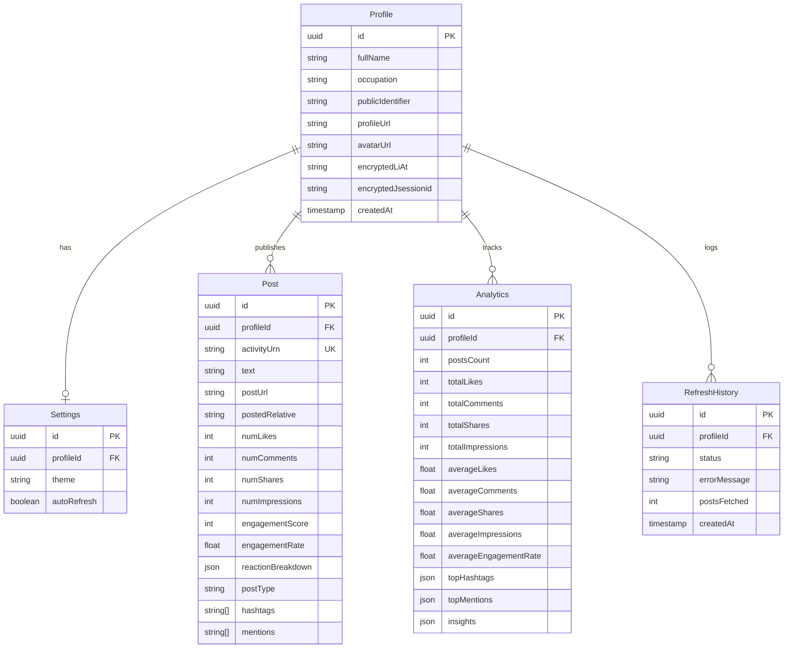

<div align="center">

# VoyagerPulse 🚀

**Advanced LinkedIn Content Analytics & Optimization Platform**

[](https://nextjs.org/)
[](https://react.dev/)
[](https://www.typescriptlang.org/)
[](https://tailwindcss.com/)
[](https://www.prisma.io/)
[](https://supabase.com/)
[](https://voyagerpulse.vercel.app/)
[](https://github.com/aayushverma246-ai/VoyagerPulse/blob/main/LICENSE)

<br />

[Live Demo Website](https://voyagerpulse.vercel.app/) • [Key Features](#key-features) • [Data Model](#architectural-data-model) • [Setup Guide](#getting-started) • [Deployment](#production-deployment)

</div>

---

VoyagerPulse is a portfolio-grade, production-ready SaaS dashboard and analytics platform designed for content creators, founders, and developer advocates. It provides comprehensive visual reporting, trends tracking, and actionable posting style recommendations.

The platform securely connects to LinkedIn's internal Voyager GraphQL API using session cookies (`li_at` and `JSESSIONID`), caching data in a normalized Supabase PostgreSQL database to perform statistical analytics and rule-based optimizations.

**Production URL**: [https://voyagerpulse.vercel.app/](https://voyagerpulse.vercel.app/)

---

## Key Features

- 🔐 **Secure Session Credentials**: Plaintext cookies never touch our database. All keys are encrypted symmetrically in database columns using AES-256-GCM.
- 📊 **Interactive Analytics (Recharts)**: High-fidelity visualizations mapping engagement score timelines, average impression scales, content type breakdowns, and hashtag performance.
- ⚡ **Rule-Based Insights**: Custom analytical algorithms parsing keywords, character lengths, and formatting structure to generate posting recommendations.
- 📋 **Flexible Catalog Table**: Full search filters, type categorization, dynamic column sorting, pagination, and one-click client-side CSV downloads.
- 🏆 **Performance Highlighting**: Clean cards showing top ranked updates, visual statistics, copy-to-clipboard actions, and quick-launch links.
- 👤 **Supabase Authentication**: Secure login, registration, and account middleware handlers.
- 🧪 **Interactive Demo Seeder**: reviewer-friendly seeder mode generating synthetic mock data matching real-world structures instantly.

---

## Tech Stack

| Tier | Technology | Description |
|---|---|---|
| **Frontend** | React 19 / Next.js 16 (App Router) | High-performance React engine with TypeScript. |
| **Styling** | Tailwind CSS v4 & Framer Motion | Obsidian dark mode first design with glassmorphism panels. |
| **Database** | Supabase (PostgreSQL) | Fully relational storage, schema RLS, and sync triggers. |
| **ORM** | Prisma v5 | Type-safe queries, migration managers, and model mappings. |
| **Charts** | Recharts | Dynamic interactive SVGs for performance mapping. |
| **Table** | TanStack Table | Heavy-duty sorting, filtering, and exports handlers. |
| **Auth** | Supabase Auth (PKCE) | User profile syncer and server middleware redirects. |

---

## Architectural Data Model

VoyagerPulse is backed by a highly normalized schema mapping user profiles, posts data, analytics, settings, and refresh logs:



---

## Getting Started

### 1. Prerequisites
Ensure you have `Node.js >= 20.x` and `pnpm >= 10.x` installed locally.

### 2. Installation
Clone this repository and install dependencies:
```bash
pnpm install
```

### 3. Setup Environment Variables
Create a `.env` file in the root workspace based on `.env.example`:
```bash
cp .env.example .env
```
Fill in the following variables:
- `DATABASE_URL`: Connection pooled Postgres string.
- `DIRECT_URL`: Direct database connection bypassing poolers (used for migrations).
- `NEXT_PUBLIC_SUPABASE_URL` / `NEXT_PUBLIC_SUPABASE_ANON_KEY`: Keys from your Supabase Project API Settings.
- `ENCRYPTION_KEY`: A 64-character hexadecimal key (32 bytes) used for cookie column security.

### 4. Database Setup & Migrations
Initialize database schemas and compile Prisma types:
```bash
npx prisma db push
npx prisma generate
```

### 5. Running Locally
Launch the Next.js development server:
```bash
pnpm run dev
```
Open `http://localhost:3000` to review the dashboard.

---

## Production Deployment

This project is configured for automated Vercel hosting using Next.js App Router parameters:

```bash
# Log in to Vercel CLI
vercel login

# Link repository to your workspace
vercel link

# Build and deploy previews
vercel deploy

# Promote preview to production URL
vercel deploy --prod
```

During deployment, Next.js will automatically run `"prisma generate && next build"`, compiling database types and bundling static segments.

---

## Security Framework

1. **Row Level Security (RLS)**: PostgreSQL tables are locked down. RLS policies ensure that authenticated users can only select or modify their own data matching their `auth.uid()`.
2. **Plaintext Protection**: Symmetric encryption is handled via Node's `crypto` module implementing AES-256-GCM. Plaintext cookie variables are destroyed in memory immediately following HTTP Voyager fetches.
3. **No LLM Leaks**: Insights calculation runs in a sandbox on our backend service utilizing rule-based mathematics. No third-party LLM providers can scrape or index your data without explicit opt-in.

---

## Packaging & Distribution

To package a clean, production-ready, and credential-stripped copy of this codebase for sharing or publishing to GitHub (excluding `.env`, `node_modules`, and build folders), run:

```bash
pnpm run zip
```

This executes our bundle utility `scripts/bundle-project.js`, which recursively packages the repository contents into a clean `voyagerpulse.zip` file in the project root.

---

## Future Improvements
- **LLM Insights Enrichment**: Integrate OpenAI/Gemini connectors so users can ask conversational questions about their content (e.g. "Draft a post similar to my top performing text updates").
- **Auto Sync Cron scheduler**: Execute automatic, daily updates in the background using Supabase Cron Webhooks.
- **Multilingual Tokenizer**: Implement custom TF-IDF keyword parsers supporting content analysis across different languages.
